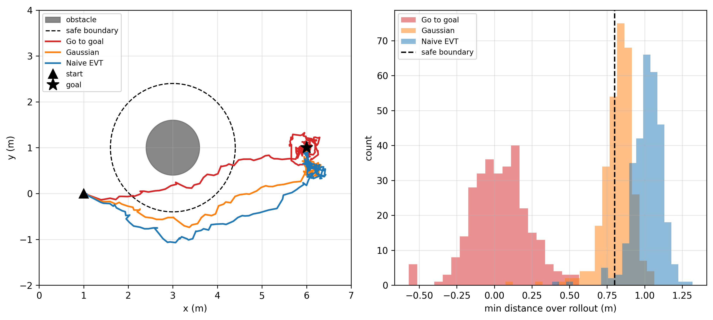
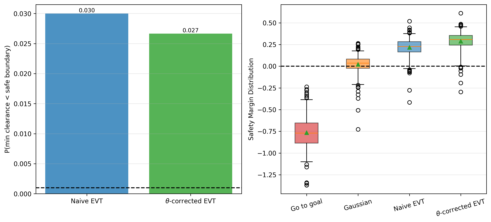

# Robot Safety under Extreme Rare Catastrophic Events

The full nonlinear tube-SMPC controller (see
[smpc-evt-tube](https://github.com/XiuzhenYeee/Stochastic-Model-Predictive-Control-Algorithm-Design-under-Extreme-Rare-Events)
for how it works) run head-to-head under four tightening strategies, to
measure what the θ-correction actually buys you on the real closed-loop
system — not just on a frozen-gain approximation.

## The four controllers

| Controller | Tightening |
|---|---|
| `baseline` (go-to-goal) | none |
| `gaussian` | assumes Gaussian tube error |
| `evt` | POT/GPD quantile, naive per-step $\epsilon$ |
| `evt_theta` | POT/GPD quantile, θ-corrected $\epsilon_\star = -\ln(1-\epsilon)/(\theta N)$ |

`evt` and `evt_theta` use the *same* GPD tail estimator and the *same*
tube-MPC solve at every step — the only difference is the target
probability level passed in, using this scenario's own validated θ. Any
difference in outcome between them is therefore attributable to the
clustering correction alone, not to a different estimator or solver.

## Results

**Figure 1 — scenario and naive-tightening comparison.** Representative



**Figure 2 — effect of the θ-correction.** Empirical violation probability
for naive-EVT vs. θ-corrected-EVT against the target $\epsilon$ (left), and
safety-margin distribution across all four controllers (right).



## Install

```bash
pip install -r requirements.txt
```

Needs `numpy`, `scipy`, `matplotlib`, and `cvxpy` (with its bundled OSQP
solver) — this is the full nonlinear MPC pipeline.

## Reproduce the figures above without rerunning the simulation

```bash
python plot_figures.py
```

Reads `data/comparison_data.npz` (the exact data behind the figures above —
$M=300$ trials, fixed seeds) and renders `fig1_scenario_comparison.{png,pdf}`
and `fig2_theta_correction.{png,pdf}` into `figures/`.

## Rerun the full comparison from scratch (slow)

```bash
python main_compare_controllers.py   # overwrites data/comparison_data.npz
python plot_figures.py
```

This reruns all $M=300$ trials for all four controllers, re-estimating θ
for the scenario and refitting the GPD tail from fresh Monte Carlo samples
at every MPC re-solve — it prints "OVERNIGHT settings ... this will take a
long time" and checkpoints progress to `data/checkpoint.npz` every 10
trials.

## Contents

- `main_compare_controllers.py` — runs the $M=300$-trial comparison above.
- `main_linearize_smpc.py` — the linearize-and-resolve (SCP) tube-SMPC
  solver used inside the comparison.
- `main_Monte_Carlo.py` — standalone Monte Carlo safety-evaluation utility.
- `plot_figures.py` — renders the two figures above from saved data.
- `Helper_*.py` — system setup and disturbance sampling, DLQR gain,
  dynamics/obstacle linearization, nominal rollout, GPD/EVT quantile
  estimation (`pot_gpd_quantile`), **extremal-index estimation for this
  scenario** (`Helper_extremal_index.py` — computes this run's θ̂ and
  $\epsilon_\star$), the tightened-QP solve, and shared type/dataclass
  definitions.

## Related

- [smpc-evt-tube](https://github.com/XiuzhenYeee/Stochastic-Model-Predictive-Control-Algorithm-Design-under-Extreme-Rare-Events) —
  the standalone naive-EVT-only version of this controller
  (baseline/Gaussian/EVT, no θ-correction), with more detail on the
  tube-SMPC method itself.
